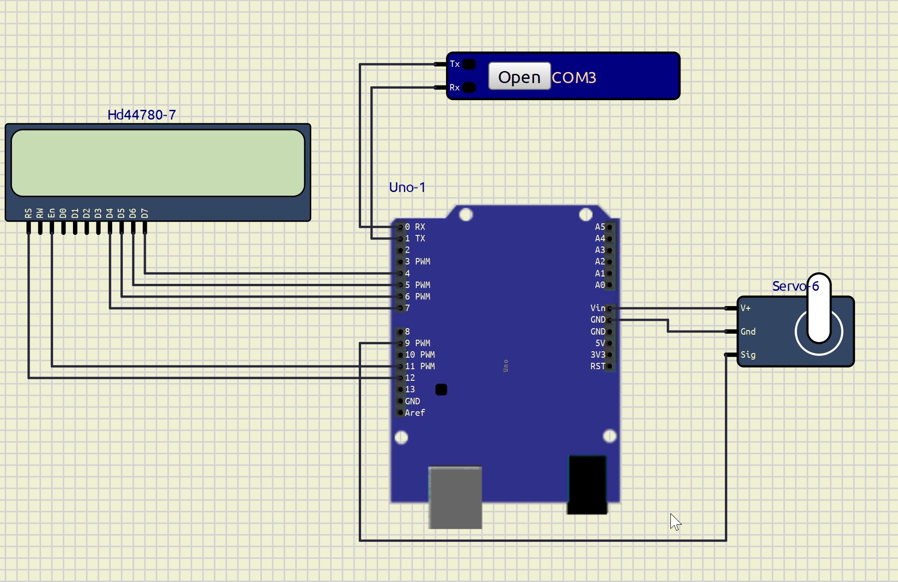
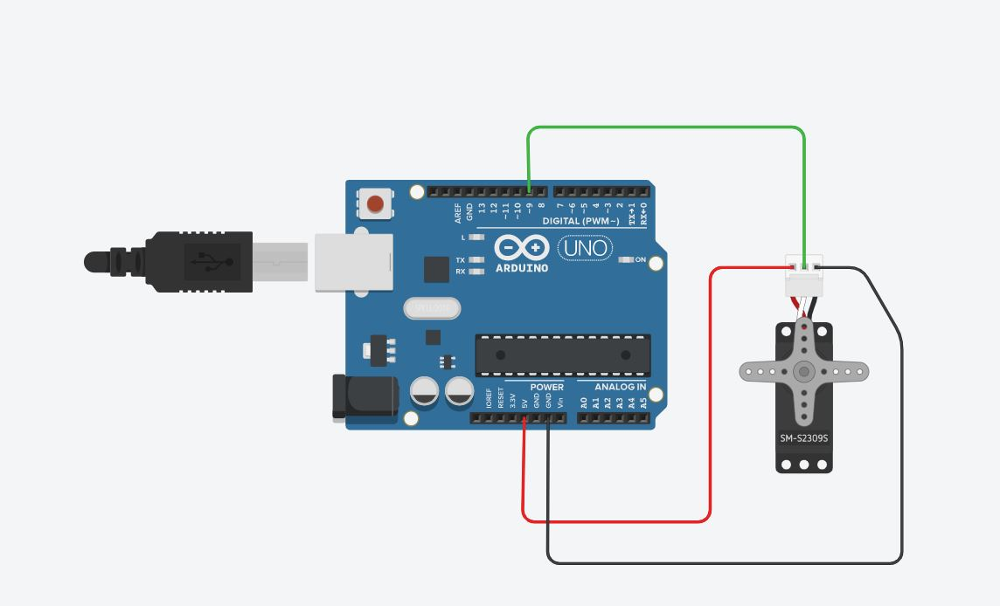

# Face Locking Door Using Python and Arduino
This project implements a face recognition system using OpenCV and Face Recognition libraries in Python. When a known person is recognized, the system sends a command to an Arduino to open a door. Additionally, the system uses `pyttsx3` for text-to-speech announcements.

## Prerequisites

- Python 3.10+
- Arduino with Servo motor (for physical testing)
- IP Camera (e.g. ip webcam mobile app)
- Virtual Serial Port Software (e.g., com0com for Windows)
- SimulIDE (for simulation)

# Required Components
1.Arduino UNO


2.Servo Motor


## Libraries and Tools

- OpenCV
- face_recognition
- pyttsx3
- serial
- threading
- queue

**CIRCUIT DIAGRAM**





## Installation

1. Clone the repository:
    ```sh
    git clone https://github.com/Ay0ubN0uri/face-locking-door.git
    cd face-locking-door
    ```

2. Install the required Python libraries:
    ```sh
     pip install -r requirements.txt
    ```

3. Set up the virtual serial ports using com0com or similar software.

4. Upload the provided Arduino code to your Arduino board.

5. Download and install SimulIDE for simulating the Arduino and servo motor.